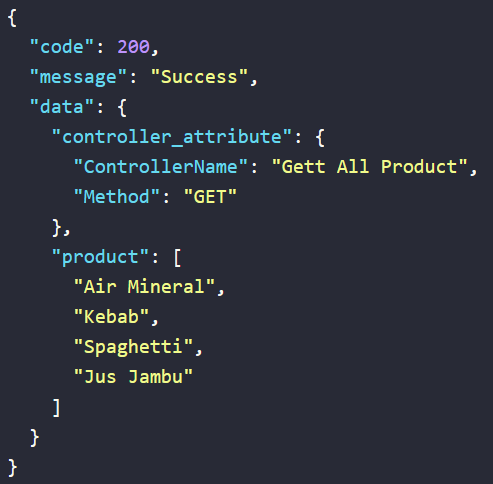

# CODELAB

## Project Structure

```
project-root/
│
├── Controller/
│   ├── Controller.php
│   ├── ProductController.php
│
├── Traits/
│   ├── ResponseFormatter.php
│
├── index.php
```

## Description

This project includes a simple PHP application with a basic folder structure. It consists of a Controller directory with two PHP files (`Controller.php` and `ProductController.php`), a Traits directory with a file named `ResponseFormatter.php`, and an `index.php` file.

### Controller/Controller.php

This file defines a base Controller class with attributes `controllerName` and `controllerMethod`. It has a method `getControllerAttribute()` to retrieve the controller attributes.

### Traits/ResponseFormatter.php

This file contains a PHP trait named `ResponseFormatter` with a method `responseFormatter()` for formatting JSON responses.

### Controller/ProductController.php

This file extends the base Controller class and uses the `ResponseFormatter` trait. It defines a `ProductController` class with a constructor setting controller attributes and a method `getAllProduct()` to get dummy product data and format a JSON response.

### index.php

The main entry point of the application includes the `ProductController` and demonstrates calling the `getAllProduct()` method.

## Usage
- Run the PHP server.

   ```bash
   php -S localhost:8888 index.php
   ```
- Access [http://localhost:8888](http://localhost:8888) in web browser.


